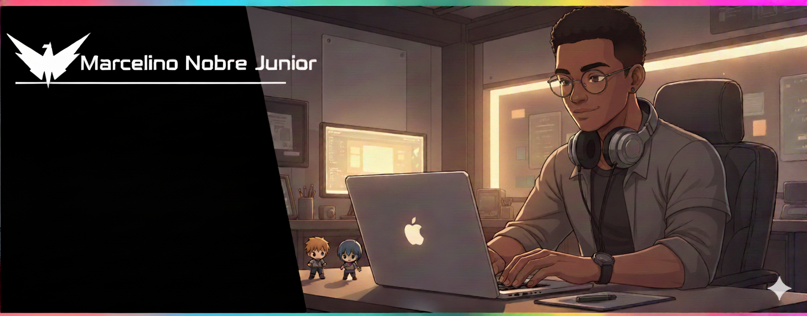

  

#
<h3 align="center">
  FullStack Developer • IT Automation Consultant
</h3>

#

 

  

<strong>About me</strong>

-  Hello! My name is Marcelino Junior and I am a FullStack Developer.  
-  My current goal is become a Software Architect. 
-  My main stack is .NET with React and NodeJs with React. 
-  I always try to be a polite and respectful person, and I love interacting with new people and sharing my story. 

## 
<h3><strong>My Stack</strong></h3>

#

  
<strong>Contact Me</strong>

#
